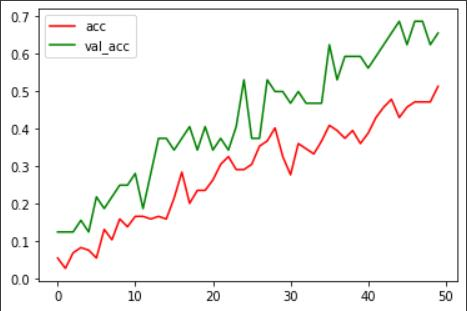
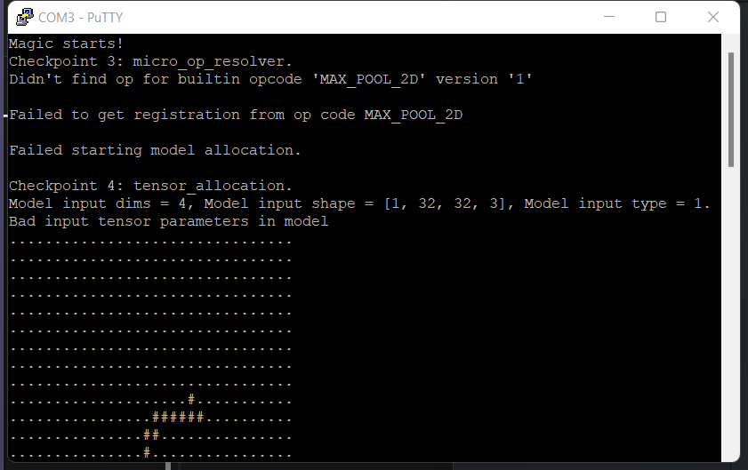
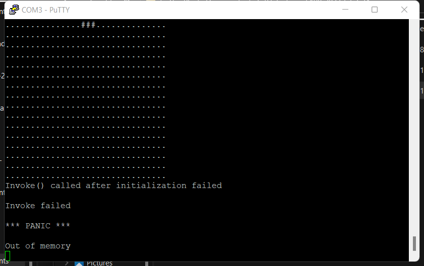

# ese5190-2022-final-project-keyboard-part

## Goal
The original magic_wand_ble model can only classify between 0-9. We built our network to classify between both 0-9 and A-Z, which means our model has 36 classes now.

## Result
Colab version of the training part: https://colab.research.google.com/drive/1JqMVoSU88o-7ZZmzwoQUtnsRRwZ0dx7c?usp=sharing

The accuracy of our model after 50 epochs of training:



## Issues
We cannot find how the author, ArduCAM, of the [magic_wand_ble project](https://github.com/ArduCAM/pico-tflmicro/tree/main/examples/magic_wand_ble) train the original model. Thus, we built a classification network from scratch, referencing the network structure of [magic_wand project](https://github.com/tensorflow/tflite-micro/tree/main/tensorflow/lite/micro/examples/magic_wand) of tflit.

### TFLite Issue
We encountered a warning stating `WARNING:absl:Found untraced functions such as _jit_compiled_convolution_op, _jit_compiled_convolution_op while saving (showing 2 of 2). These functions will not be directly callable after loading.`. We found [this issue](https://github.com/tensorflow/tensorflow/issues/47554) is still opening on the TFLite Github. We were not sure if this warning would affect the loading process of our model.

### Data Type Issue
In the magic_wand_ble code, it requires the type of the model input to be `kTfLiteInt8 = 9`. We specified the data type of our dataset as `int8` when we converted data to tensor `tf.convert_to_tensor(this_data_batch, dtype=tf.int8)`. However, we load the pre-trained model to the magic_wand_ble system, it shows that the model input data type is still `kTfLiteFloat32 = 1`. We do not know how to solve this yet.



### Model Size Issue
The new model is about twice as big as the original model (original model: around 20000 parameters; our model: around 50000 parameters). Our system will out of memory after several times of writing.



## Notes
Add this at the beginning of model.cc:

```
/* Copyright 2022 The TensorFlow Authors. All Rights Reserved.

Licensed under the Apache License, Version 2.0 (the "License");
you may not use this file except in compliance with the License.
You may obtain a copy of the License at

    http://www.apache.org/licenses/LICENSE-2.0

Unless required by applicable law or agreed to in writing, software
distributed under the License is distributed on an "AS IS" BASIS,
WITHOUT WARRANTIES OR CONDITIONS OF ANY KIND, either express or implied.
See the License for the specific language governing permissions and
limitations under the License.
==============================================================================*/

// Automatically created from a TensorFlow Lite flatbuffer using the command:
// xxd -i magic_wand_model.tflite > magic_wand_model_data.cc
// See the README for a full description of the creation process.

#include "magic_wand_model_data.h"

const unsigned char g_magic_wand_model_data[]
```
